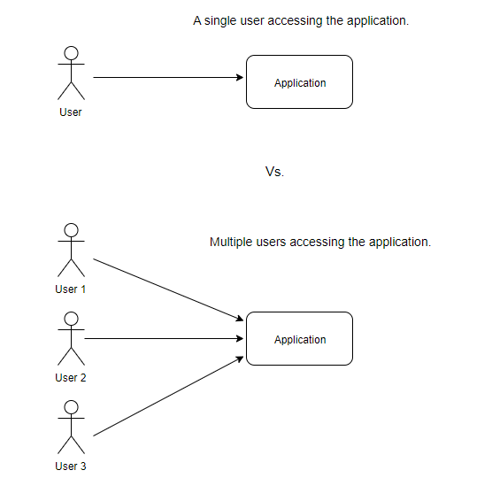
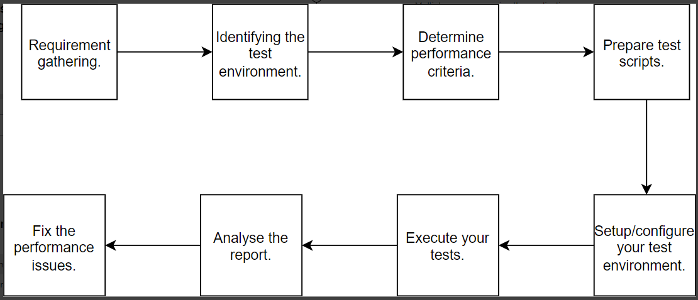
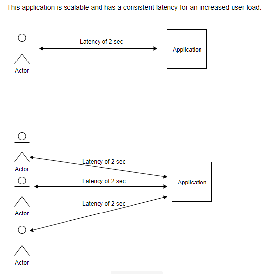
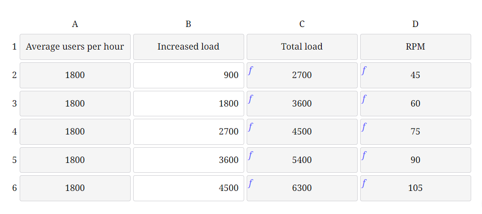
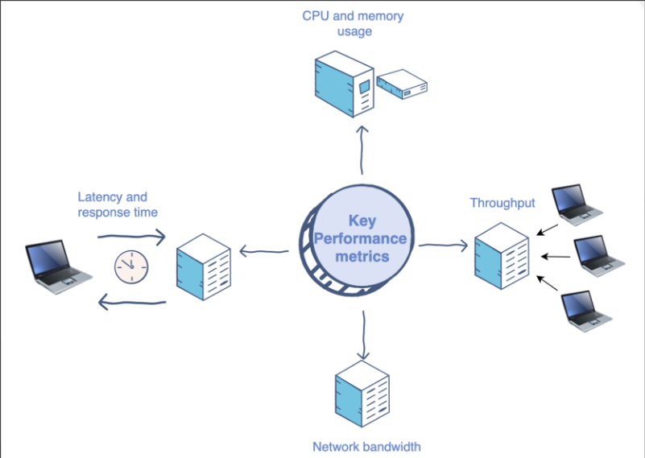
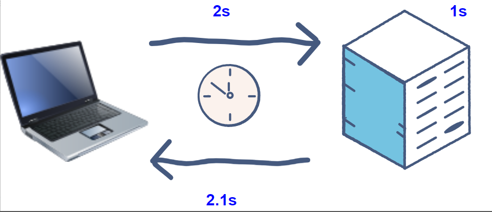
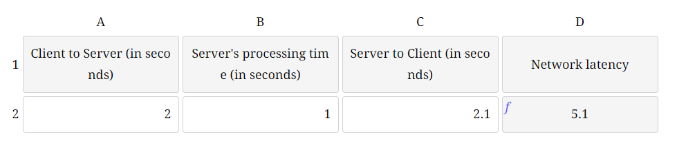

# GATLING PERFORMANCE TESTS

## What is performance testing?

We will discuss the basics of performance testing, why it is important, various types of performance testing, and a few performance issue indicators.

## Basics of Performance Testing

Performance Testing determines the speed , scalablity and stability of the application under different workloads.

* It is a type of non-functional testing since it focuses on checking the readiness of the system.

* For any application, the end-user experience is very important, as it defines the success or failure of the business. No software system can do well without a good user experience, which is why understanding the performance metrics or capability of a system becomes very critical.

## Types of Performance Testing

There are various aspects of performance testing. The most important ones are the followring :
* Load testing
* Scalability testing
* Stress testing
* Web page performance testing
* Network throttling

## Performance Issue Indicators

There are various indicators of a software system that lead to a bad performance

* High CPU and memory utilization
* Increased consumption of network bandwidth
* Throughput
* High latency and response time
* Increased page load time

### What are the types of performance testing?

There are various types of testing that can be performed to effectively determine performance bottlenecks.

* **Load Testing** – It determines the overall load capacity of the system by identifying the system’s performance during average, peak load, and when the load limit is above the threshold of the break.

* **Stress testing** – It determines the performance of a system under certain load conditions for an extended duration of time. It also examines whether or not an application performs necessary error handling in case of failures or crashes.

* **Scalability Testing** – This is the measure of the ability of the system (hardware and software) to scale up or down based on the number of requests or increased load.

* **Page load performance testing** - It Identifies the page’s load time and user experience in terms of speed and usability.

Ideally, the user experience of a single user vs. multiple users should be the same for better user engagement, as shown in the diagram below:

### Process and steps involved in performance testing

Let’s try to understand the process of performing performance testing for any software system.

In this phase, we gather the requirements related to performance testing which includes:

* Modules
* The exact flow that needs to be tested
* Required test data
* Types of performance testing needed (like - load, stress, scalability, page load, etc.)
* Stakeholders and cross-teams to be involved

In order to successfully execute the performance testing, the test environment should be identified. This could be a replica of production or any other environment with the same server, node, database, cache, queues, and other configurations for production.

We need to get the details of the current load and the scale to test, such as current load * X, where X is the multiplier. This gives the expected ramp-up, i.e., two times or three times. This information can tell us the expected page load and duration of the load. This data will help validate the results with the expected performance criteria.

Write the automated tests using the language and tools of your choice for running performance testing or the manual test cases to be used.

Write the automated tests using the language and tools of your choice for running performance testing or the manual test cases to be used.

Setup the test environment with the prerequisite data or services configuration.

Ideally, before running your tests, you have to notify your team and relevant stakeholders about the performance testing time window. After that, execute the tests, and monitor the server performance graphs.

Analyze the report to ensure that the performance criteria is met or to highlight the identified bottlenecks.

Identify bottlenecks and performance issues, fix those issues, and re-run the scripts to validate those issues.

## Scalability Testing

**What is scalability testing?**

In this type of testing, we measure the performance of the system in terms of its capability to scale with an increased load (from a hardware and software perspective).

Let’s say a system performs well with an expected latency for 100 concurrent users. Now we have increased the load to 300 concurrent users.

**Latency :** It is a measure of the amount of time that a system takes to respond to a user’s request. Ideally, upon the increased load, we expect the latency to be the same if a system is scalable.

A good scalable system will ensure the same user experience for the increased load, as shown below:

Key metrics for scalability testing
In many surveys, it has been found that users will not give an application a second chance if they had a bad first experience. They will go straight to a competitor’s product instead.

It is very important, therefore, to look at the certain key metrics that should be measured and examined during scalability testing:

* The latency of the requests
* Throughput of the system
* CPU usage
* Memory usage
* Network usage

The above data for an application can be easily fetched from some of the server-side monitoring tools like Grafana or New Relic.

## Load and Stress Testing

### What is load testing?

Load testing is a type of performance testing that examines the system’s behavior under average and maximum load.

Let’s look at an example website where the average load is around 1800 users per hour.

RPM (requests per minute) = 1800/60 = 30

### **Load test estimates**

You can change the load and see how it affects the requests per minute.

We would increase the load gradually on the system as shown above to the point where it starts crashing, and that would be the maximum load that the system could handle.

### What is stress testing?

Stress testing is also known as endurance testing. It verifies the system’s error handling capability and its reliability under extreme conditions or load.

**Let’s take an example of an application where :**

Average load = 70 RPM ( Requests per minute)

Let’s increase the average load by 5X = 350 RPM

Duration of load = 30 minutes, which means it will simulate a load of 350 RPM for 30 minutes constantly.

This rate will help us examine the system’s capability in an increased load for an extended period of time and its ability to manage the errors, failures, or system crashes that occurred due to stress.

“**Difference between load and stress testing” The difference between the load and the stress testing** is that in the load testing, examines the maximum load that a system can take at any given point of time. Stress testing, on the other hand, examines the system’s behavior upon an increased load for an extended period of time.

## Key Performance Metrics

There are various key metrics that we use to evaluate the performance of a system. These are:

When the load increases, the server would need more computing power in terms of memory and CPU to scale. This can be achieved using vertical or horizontal scaling.

**Vertical scaling :** This occurs when we increase the computing power of the server by adding more resources (CPU, RAM) so that the application can handle an increased load.

**Horizontal scaling :** This occurs when we increase the number of servers so that the application can handle the increased load.

This is the measure of the maximum amount of data that can be transferred per unit of time through the given network.

Let’s say we have a network bandwidth of 128kbps, which means 128kb of maximum data can flow through the network per sec.

**kbps** – kilobits per sec

Throughput is the measure of the amount of data transferred at a given time. In other words, throughput is the number of requests a software system can process successfully per time unit (per sec or per hour or per minute).

Let’s look at an example. If a packet with a size of 10 bytes takes 1 second to flow from system A to the system B, we can say the throughput between the two systems is 80bits per sec (80bps ~ 0.08kbps).

**1 byte** = 8 bits

"**Difference between throughput and network bandwidth" :** Throughput is the actual measurement of how much data is successfully transferred through the network, whereas network bandwidth is a theoretical measurement. Throughput will always be less than network bandwidth.

This is the time taken for a client to get the server response once a request was sent. It is also known as ‘Network Delay’.

* The client sends a request at time=0.
* The request reaches the server in 2 seconds at time=2.
* The server takes 1 second to process (time= 3)
* The response reaches the client in 2.1 seconds (time=5.1)

The network latency = 2+1+2.1 = 5.1 seconds.

You can change the request and process time to see how it affects the network latency.

## Performance Testing Tools

 let’s look at some of the most widely used open-source performance testing tools, which are:

**Jmeter :** 

Jmeter is an open-source Java-based load and performance testing tool that supports a variety of applications, servers, and protocols like HTTP, TCP, SOAP, Web, LDAP, etc. It is easy to use and is one of the most popular performance testing tools out there. It provides both a UI and programmatic way of doing load testing.

**Gatling :**

Gatling is a powerful load testing tool that uses Akka actors to simulate a huge load of users. The tests are written in the Scala language and use DSL, which makes it easy to understand and write with minimal knowledge of Scala. It comes in both open source and enterprise versions. In this course, we will use the open-source version of Gatling to show it’s common capabilities and usage.

**Akka actors:** The Actor Model provides a higher level of abstraction for writing concurrent and distributed systems. It alleviates the developer from dealing with explicit locking and thread management, making it easier to write correct concurrent and parallel systems.

**Lighthouse :**

Lighthouse is used for measuring website performance.

As per the official definition of Lighthouse:

Lighthouse is an open-source, automated tool for improving the quality of web pages. You can run it against any web page, public, or requiring authentication. It has audits for performance, accessibility, progressive web apps, SEO, and more

## Introduction to Gatling

### What is Gatling?

**Gatling** is a highly capable load and stress testing tool that is designed for:

* Ease of use
* Maintainability
* bHigh performance
* Distributed load testing

**Gatling** is based on Scala, Akka, and Netty. Gatling comes with excellent support of the HTTP protocol, making it the tool of choice for load testing of any HTTP server.

### **Architecture of Gatling**

The architecture of Gatling is asynchronous as long as the underlying protocol, such as HTTP/HTTPS, can be implemented in a non-blocking way.

This kind of architecture allows us to implement virtual users as messages or actors instead of dedicated threads, making them more resource-efficient as they consume less memory. Thus, running thousands of concurrent virtual users is not an issue in comparison to thread-based load testing tools like JMeter.

**Gatling** also provides a commercial version, **Gatling** Frontline, that offers more advanced features.

### **Gatling Features**

